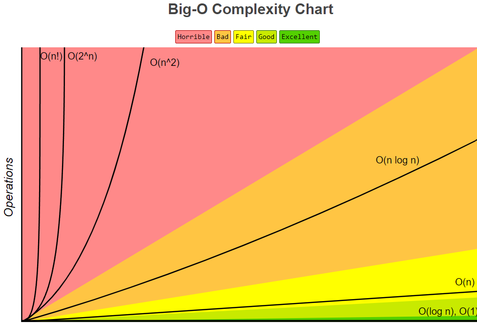
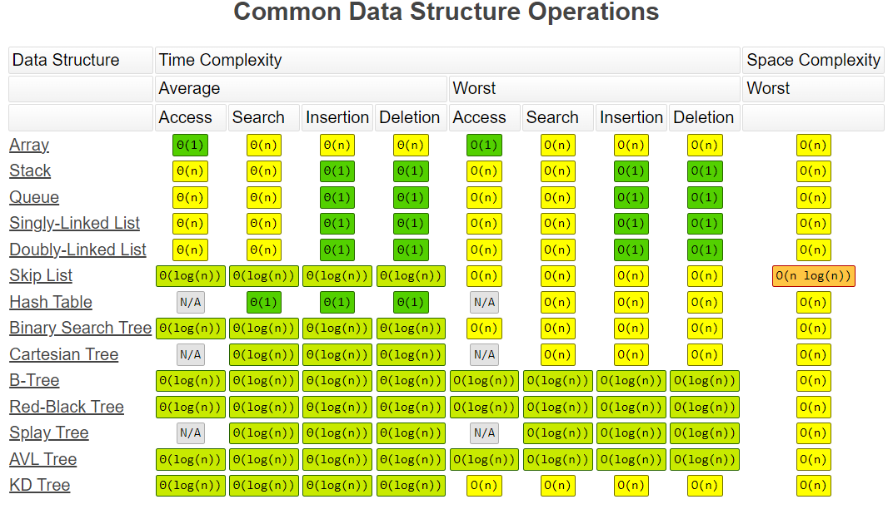
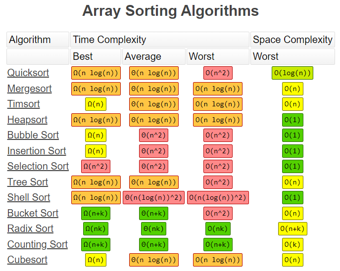

## Time Complexity
1. big O optimizing for time complexity.  
2. omega - best case, theta -average case, and omicron Big O -worst case  
3. O(n) linear time complexity, proportional time complexity;  
 `function logItems(n) {
    for (i = 0; i < n; i++) {
        console.log (i)
    }
}`    
4. O(n^2)  - nexted for loops are example n*n (same if it is O(n^3) etc)
`function logItems(n) {
    for (i = 0; i < n; i++) {
        for (j = 0; j < n; j++) {
        console.log(i, j)
    }
}
}`      
5. `function logItems(n) {
     for(let i = 0; i < n; i++) {
         for(let j = 0; j < n; j++) {
             console.log(i, j) 
         }       
     } 
 
     for(let k = 0; k < n; k++) {
         console.log(k)
     }
 }`  
 
 logItems(10)--This is the same as O(n^2)  

 6. O(1) referred to as constant time. Most efficient time complexity. 
 `function constantTime(n) {
    return n + n + n
 }  
 7. Divide and conquer: log(sub 2) 8 = 3, or 2^3 = 8; O(log n)- almost as efficient as O(1)  

 ## Arrays operations with time complexity 
 1. push() and pop(): O(1) - adding/deleting from the end of array
 2. shift(), unshift(): O(n) because of the re-indexing, adding/deleting from beginning. It runs through n number of times in the array.
 3. array.splice(1, 0, "Hi") - index of 1, not deleting, adding "Hi". O(n) because of reindexing.   
 4. Arrays are a great data structure if you are accessing by index, but possibly not for other operations.   
  
## Wrap up  
  

  

  
