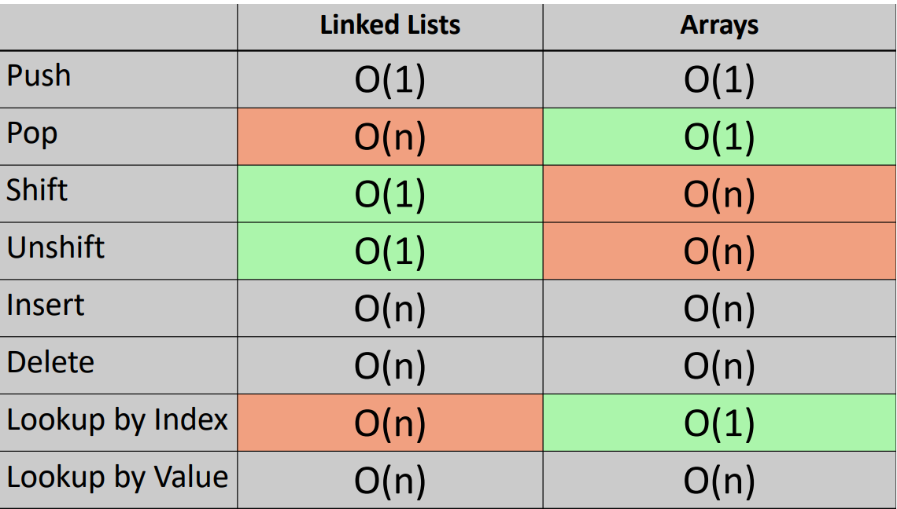

## Linked Lists  

Linked Lists are similar to arrays but without indexes. Arrays are in continuous places in memory, but linked lists are not--the can be all over the place. Link lists have heat, tail, pointers, and null.  

### Time complexity of linked lists  vs arrays  

  

